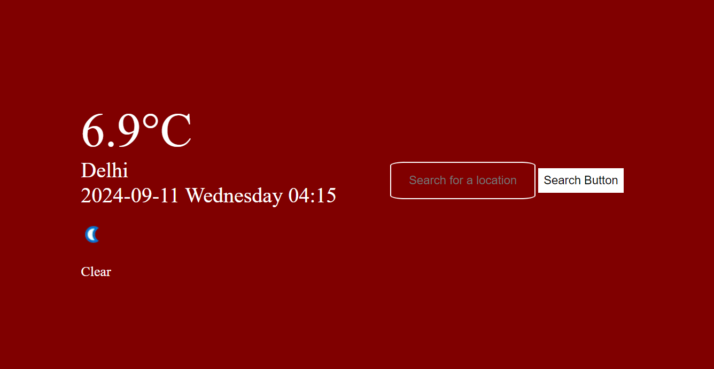

# Weather App

Welcome to the Weather App repository! This project is a simple yet powerful web application that allows users to view real-time weather information for any location.



## Table of Contents
- [Features](#features)
- [Live Demo](#live-demo)
- [Technologies Used](#technologies-used)
- [Setup and Installation](#setup-and-installation)
- [Usage](#usage)
- [Contributing](#contributing)
- [License](#license)

## Features
- Get current weather details for any city or location
- View temperature, weather conditions, humidity, wind speed, and more
- Clean and responsive user interface
- Supports multiple locations by city or geographic coordinates

## Live Demo
You can try the live version of the app here:
[Weather App Live Demo](https://lishaangral.github.io/weather-app/)

## Technologies Used
- **HTML5**: For building the structure of the app
- **CSS3**: For styling and making the app responsive
- **JavaScript**: For client-side logic and interaction
- **OpenWeather API**: Used to fetch real-time weather data
- **GitHub Pages**: For hosting the live demo

## Setup and Installation
1. Clone the repository to your local machine:
    ```bash
    git clone https://github.com/lishaangral/weather-app.git
    ```
2. Navigate to the project directory:
    ```bash
    cd weather-app
    ```
3. Open `index.html` in your browser to view the app:
    ```bash
    open index.html
    ```

## Usage
1. Enter the name of a city or use your current location.
2. The app will display weather information like temperature, wind speed, humidity, and weather description.
3. You can search for multiple locations and compare the weather in different areas.

## Contributing
Contributions are welcome! Feel free to fork the repository and submit a pull request with your changes. Before contributing, please ensure:
- Your code follows the repository's style guidelines.
- You have tested your code thoroughly.

## License
This project is licensed under the MIT License. See the [LICENSE](LICENSE) file for details.

---
